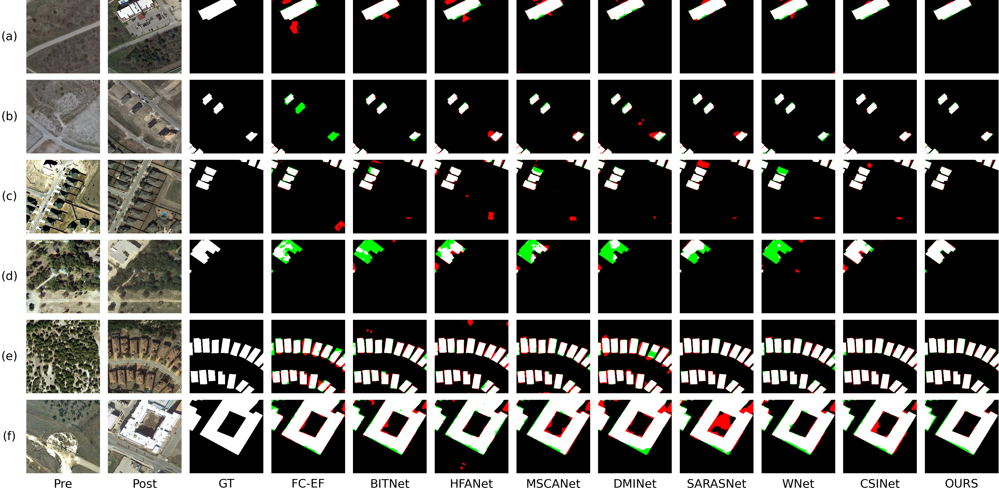
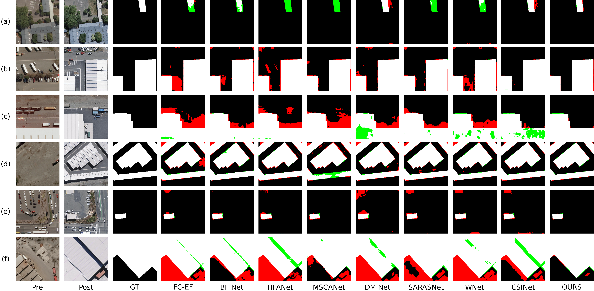
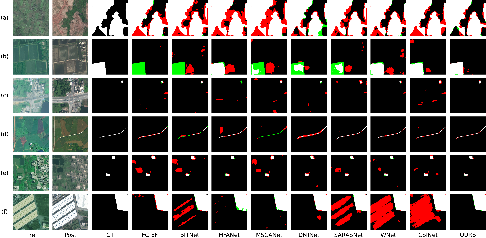

# TTMGNet: TTMGNet: Tree Topology Mamba-Guided Network Collaborative Hierarchical Incremental Aggregation for Change Detection
⭐ This code has been completely released ⭐ 

⭐ our [article](https://doi.org/10.3390/rs16214068) ⭐ 

If our code is helpful to you, please cite:

```
@article{wang2024ttmgnet,
  title={TTMGNet: Tree Topology Mamba-Guided Network Collaborative Hierarchical Incremental Aggregation for Change Detection},
  author={Wang, Hongzhu and Ye, Zhaoyi and Xu, Chuan and Mei, Liye and Lei, Cheng and Wang, Du},
  journal={Remote Sensing},
  volume={16},
  number={21},
  pages={4068},
  year={2024},
  publisher={MDPI}
}
```
## To Train 
 ```
cd TTMGnet
python train.py 
```

## To Test
cd TTMGnet
python test.py

### Pre-trained model to be uploaded later

## Dataset
Downloading the LEVIR-CD dataset from [LEVIR-CD](https://pan.baidu.com/s/1L7EJCGMivXm4OayRzjqa8w?pwd=7jp3)
Downloading the WHU-CD dataset from [LEVIR-CD](https://pan.baidu.com/s/1e0WPuyQVZBIQTzGbuk64ag?pwd=7jp3)
Downloading the CL-CD dataset from [LEVIR-CD](https://pan.baidu.com/s/1rG2PXDvd95D8VmhPfaBi8g?pwd=7jp3)

## overall network

<p align="center">  </p>

## Results

### LEVIR Datasset
#### Qualitative result
<p align="center">  </p>
- Six representative images of the LEVIR-CD test set.

#### Quantitative Results

|   **Methods**    |   **Precision**   |   **Recall**   | **F1** | **OA** | **mIOU** | **Kappa** |
|:----------------:|:---------:|:---------:|:---------:|:------------:|:-----------------------:|:---------:|
| **FC-EF**         |   0.7991     | 0.8284    |  0.8135     |   0.9580      |  0.8197     |  0.7899   |
|  **BITNet**  |   0.8732      |   0.9141  |  0.8932    |   0.9759      | 0.8900   |  0.8796    |
| **HFANet**       |   0.8336      | 0.9148    |   0.8722     |  0.9671       | 0.8703    | 0.8556       |
| **MSCANet**    |  0.8375    |  0.9185  |  0.8761      |   0.9713        | 0.8738        |   0.8599   |
| **DMINet**    |  0.8419      | 0.8669     | 0.8685     | 0.9700       |  0.8672     |  0.8516     |
|   **SARASNet**    |0.8948       |  0.9264   | 0.9103        |0.9798         |0.9064      |  0.8990     |
|  **WNet** |  0.8973     |  0.8991  | 0.8977       |  0.9774       |   0.8946     |  0.8850    |
|  **CSINet** |  0.8861     |  0.9361  | 0.9104       |  0.9796       |   0.9064     |  0.8989    |
| **TTMGNet**     | **0.9316**  |**0.9146** | **0.9231**       |   **0.9832**  | **0.9192**  | **0.9114**|


###  WHU-CD Datasset
#### Qualitative result
<p align="center">  </p>
- Six representative images of the WHU-CD test set.

#### Quantitative Results

|   **Methods**    |   **Precision**   |   **Recall**   | **F1** | **OA** | **mIOU** | **Kappa** |
|:----------------:|:---------:|:---------:|:---------:|:------------:|:-----------------------:|:---------:|
| **FC-EF**         |   0.7043     | 0.9231    |  0.7990     |   0.9782      |  0.8212     |  0.7877   |
|  **BITNet**  |   0.8175      |   0.8869  |  0.8508    |   0.9854      | 0.8625   |  0.8431    |
| **HFANet**       |   0.7419      | 0.8956    |   0.8115     |  0.8904       | 0.8312    | 0.8013       |
| **MSCANet**    |  0.8307    |  0.9070  |  0.8672      |   0.9869        | 0.8759        |   0.8603   |
| **DMINet**    |  0.7056      | 0.9250     | 0.8005     | 0.9773       |  0.8224     |   0.7893    |
|   **SARASNet**    |0.8288       |  0.9402   | 0.8810        |0.9881         |0.8874      |  0.8747     |
|  **WNet** |  0.7151     |  0.9498  | 0.8159       |  0.9798       |   0.8340     |  0.8055    |
|  **CSINet** |  0.8628     |  0.9150  | 0.8881       |  0.9891       |   0.8937     |  0.8825    |
| **TTMGNet**     | **0.9218**  |**0.8974** | **0.9094**       |   **0.9915**  | **0.9125**  | **0.9050**|

### CL-CD Dataset
#### Qualitative result
<p align="center">  </p>
- Six representative images of the CL-CD test set.

#### Quantitative Results

|   **Methods**    |   **Precision**   |   **Recall**   | **F1** | **OA** | **mIOU** | **Kappa** |
|:----------------:|:---------:|:---------:|:---------:|:------------:|:-----------------------:|:---------:|
| **FC-EF**         |   0.5330     | 0.7351    |  0.6180     |   0.9324      |  0.6878     |  0.5819   |
|  **BITNet**  |   0.5746      |   0.7744  |  0.6597    |   0.9405      | 0.7145   |  0.6279    |
| **HFANet**       |   0.6266      | 0.7913    |   0.6994     |  0.9494       | 0.7420    | 0.6721       |
| **MSCANet**    |  0.5914    |  0.7223  |  0.6503      |   0.9422        | 0.7104        |   0.6191   |
| **DMINet**    |  0.5333      | 0.6739     | 0.5954     | 0.9319       |  0.6761     |  0.5588     |
|   **SARASNet**    |0.7125       |  0.7563   | 0.7337        |0.9592         |0.7681      |  0.7116     |
|  **WNet** |  0.6729     |  0.7856  | 0.7249       |  0.9556       |   0.7607     |  0.7010    |
|  **CSINet** |  0.6402     |  0.8272  | 0.7218       |  0.9525       |   0.7570     |  0.6963    |
| **TTMGNet**     | **0.8135**  |**0.7355** | **0.7725**       |   **0.9677**  | **0.7976**  | **0.7555**|

If you have any questions, please contact me by email (liyemei@whu.edu.cn).
